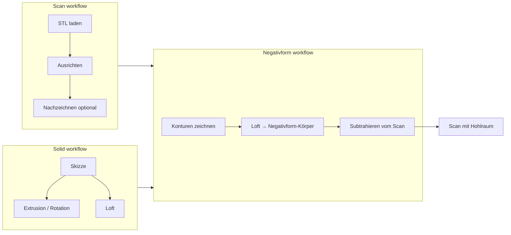
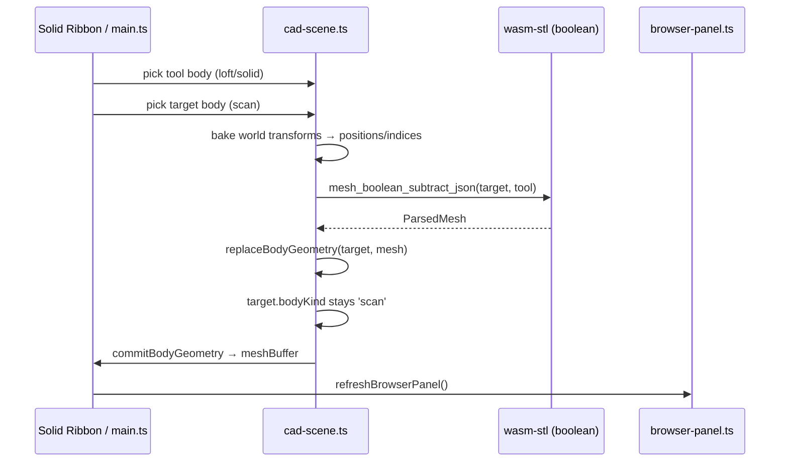
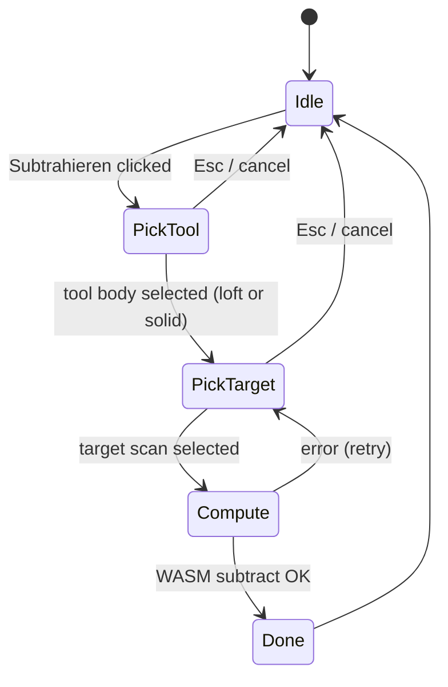

# Hybrid CAD: Scan + Solid + Negativform

| Field | Value |
|-------|-------|
| **Status** | Draft |
| **Author** | Systems Architecture |
| **Date** | 2026-06-08 |
| **Repo** | `/Users/jens/Documents/GitHub/cad` |
| **Related** | `AGENTS.md`, `src/ARCHITECTURE.md` |

---

## Overview

CAD is a browser-based, Fusion 360–inspired design tool (Vite 6, TypeScript, Three.js, Rust WASM `wasm-stl`). The product focus is a **Design workspace** for three cooperating workflows:

1. **Scan** — import and manipulate triangle meshes (STL).
2. **Solid** — construct bodies from sketch profiles (extrude, revolve, loft, patterns, mirror, join).
3. **Negativform** — loft closed contours into a tool body, then **subtract** it from a scan to produce a cavity / mold impression.

This document defines the incremental path from the current v4 project format and mesh-concat “join” to a typed body model (`bodyKind`), real mesh booleans for subtract, sketch-only project save, and an optional lightweight feature timeline.

**Out of scope:** Manufacture, Simulation, full Fusion clone, real B-rep kernel, server-side processing.

---

## Background & Motivation

### Current state (as of `PROJECT_VERSION = 4`)

| Area | Implementation | Gap |
|------|----------------|-----|
| Workspaces | `sketch` \| `body` \| `contour` in `src/workspace-mode.ts` | No semantic distinction between scan vs constructed bodies |
| Solid ribbon | 9 working features in `src/solid-features.ts` + ops in `src/solid-ops.ts` | `solid.cut` (“Subtrahieren”) i18n exists but **no button or kernel** |
| Join | `mergeBodyGeometries()` in `src/body-edit.ts` — vertex concatenation | Not a boolean union; overlapping geometry remains |
| Negativform | Contour loft → `promoteLoftToNewBody()` labels body `"Negativform"` | Tool body is created but **never subtracted from scan** |
| Body model | `CadBodyRecord` in `src/cad-scene.ts` — no `bodyKind` | Browser shows generic `Mesh` / `leer` tags only |
| Project I/O | `pack_project` / `unpack_project` in `wasm-stl/src/project.rs` | **Single STL blob** per `.stpr`; `saveProject()` requires `ab().meshBuffer` |
| Timeline | `src/history-timeline.ts` + `src/undo.ts` | Undo step list only; not parametric feature history |

### User pain points

1. Cannot tell scan bodies from constructed solids in the browser tree.
2. Negativform workflow stops at “save as body” — the core subtract step is missing.
3. Sketch-only sessions cannot be persisted without loading geometry first (`status.noBodySave`).
4. Join misleads users expecting Fusion-style combine.

### Target Fusion Design-workspace feel



---

## Goals & Non-Goals

### Goals

| ID | Goal |
|----|------|
| G1 | Introduce `bodyKind: 'scan' \| 'solid' \| 'loft'` on runtime and persisted bodies |
| G2 | Migrate project meta **v4 → v5** without breaking existing `.stpr` files |
| G3 | Show body-kind badges in the browser panel (`src/browser-panel.ts`) |
| G4 | Infer `bodyKind` on STL load, solid ops, and Negativform promotion |
| G5 | WASM mesh **boolean subtract** (tool body from target scan) |
| G6 | Solid ribbon **Subtrahieren** UI with pick-tool → pick-target workflow |
| G7 | Allow **sketch-only** project save (meta + empty or minimal STL) |
| G8 | Optional: extend undo timeline toward feature labels (incremental) |

### Non-Goals

- Full parametric feature tree with replay / edit-on-fail
- Boolean union (`join` replacement) in this phase — join stays concat until boolean union is separately scoped
- Multi-body STL archive inside `.stpr` (deferred; v5 still stores one active-body mesh)
- Manufacture / CAM / Simulation tabs
- Placeholder ribbon buttons without kernel backing

---

## Proposed Design

### 1. Body kind taxonomy

```typescript
/** Semantic origin of a body mesh — drives UI badges and subtract eligibility. */
export type BodyKind = 'scan' | 'solid' | 'loft';
```

| `bodyKind` | Created by | Subtract role | Browser badge (DE) |
|------------|------------|---------------|-------------------|
| `scan` | `loadStlBuffer()`, restored project body with inferred scan | **Target** (minuend) | `Scan` |
| `solid` | extrude, revolve, press-pull, pattern, mirror, join, split | Tool or target (tool preferred) | `Festkörper` |
| `loft` | contour Negativform (`promoteLoftToNewBody`), solid loft feature | **Tool** (subtrahend) for Negativform | `Loft` / `Negativform` |

**Rationale:** Three values match existing workflows without over-modeling (`negativform` is a `loft` used as a tool). Label in browser can still show `Negativform` when `bodyKind === 'loft'` and `label.startsWith('Negativform')`.

### 2. Architecture — data flow after subtract



### 3. Subtract workflow (Fusion-inspired, simplified)

**Phase A (PR4):** Two-step body pick via browser or viewport click — no full command dialog.



**Rules:**

- Tool body: `bodyKind === 'loft'` OR `bodyKind === 'solid'`.
- Target body: `bodyKind === 'scan'` (strict in v1 — avoids ambiguous solid-on-solid).
- Both bodies need `meshBuffer` and `geometry`.
- World-space bake: reuse pattern from `mergeBodyGeometries()` (`body-edit.ts` lines 348–357).
- On success: update **target** body in place; tool body remains (user can hide/delete).
- On failure: status message in German; no geometry mutation.
- Undo: `pushMeshUndo('Subtrahieren')` before WASM call.

**New module:** `src/solid-subtract.ts` — host interface + pick state machine; wired from `main.ts` like `solid-features.ts`.

### 4. WASM boolean kernel

**Primary path: Manifold (C++ → Rust WASM)**

Research summary (2024–2026):

- [`manifold3d-rs`](https://github.com/NickUfer/manifold3d-rs) — safe Rust API; WASM build not yet first-class.
- Manifold upstream has experimental `wasm32-unknown-unknown` branch with documented symbol shims ([discussion #1046](https://github.com/elalish/manifold/discussions/1046)).
- Estimated WASM size: ~650 KB compressed (acceptable vs current `wasm-stl`).

**Integration in `wasm-stl`:**

```rust
// wasm-stl/src/boolean.rs (new)
#[wasm_bindgen]
pub fn mesh_boolean_subtract_json(json: &str) -> Result<ParsedMesh, JsValue>
```

JSON request (world-space meshes):

```json
{
  "target": { "positions": [...], "indices": [...] },
  "tool":   { "positions": [...], "indices": [...] }
}
```

Pipeline:

1. Build `Manifold` from indexed triangles for target and tool.
2. `target = target - tool` (Manifold boolean difference).
3. Export triangulation → existing `ParsedMesh` struct.
4. Validate manifoldness; return German error strings on failure.

**Fallback (if Manifold WASM blocked in PR3):**

- Ship `mesh_boolean_subtract_json` that returns `Err("Subtrahieren: Boolesche Operation noch nicht verfügbar")`.
- **Do not** add Subtrahieren ribbon button until fallback is removed (per “no placeholder buttons” constraint).
- Document Alternative B (pure Rust `csg-rs` / `parry3d`) as slower contingency.

### 5. Sketch-only project save

Current blocker in `main.ts`:

```typescript
async function saveProject() {
  if (!ab().meshBuffer) {
    setStatus(t('status.noBodySave'));
    return;
  }
  // ...
  pack_project(JSON.stringify(meta), new Uint8Array(ab().meshBuffer!));
}
```

**Proposed behavior:**

- Allow save when `meta` has sketches/contours/dimensions even if `meshBuffer` is null.
- Pass **minimal valid binary STL** (84-byte header, `triangle_count = 0`) to `pack_project` — no change to `wasm-stl/src/project.rs` layout required.
- On load: if STL has 0 triangles, skip `loadStlBuffer` mesh rebuild; restore sketches/contours only.
- `bodyKind` defaults to unset / empty body until user loads STL.

Extract I/O helpers to `src/project/io.ts` (per `ARCHITECTURE.md` extraction plan) in PR5.

### 6. Feature timeline (lightweight, optional)

Existing `history-timeline.ts` shows undo labels. Extension:

```typescript
export interface FeatureRecord {
  id: string;
  kind: 'extrude' | 'revolve' | 'loft' | 'subtract' | 'join' | ...;
  label: string;
  bodyId?: CadBodyId;
  timestamp: number;
}
```

- **Not** parametric replay — display-only correlation between undo steps and solid operations.
- Append feature record when solid ops complete (`promoteMeshToNewBody`, subtract).
- PR6 can add a collapsible “Features” strip under the timeline without blocking G1–G7.

---

## API / Interface Changes

### TypeScript

| File | Change |
|------|--------|
| `src/cad-scene.ts` | `CadBodyRecord.bodyKind?: BodyKind` |
| `src/project-file.ts` | `BodyKind` type; `ProjectBody.bodyKind?`; `PROJECT_VERSION = 5`; `migrateV4()` |
| `src/browser-panel.ts` | `BrowserBodyItem.bodyKind`; badge in `bodyRow()` |
| `src/wasm.ts` | Export `mesh_boolean_subtract_json` |
| `src/solid-features.ts` | Add `'subtract'` to `SolidFeatureId` (after WASM lands) |
| `src/solid-subtract.ts` | **New** — subtract host + pick workflow |
| `src/i18n/de.ts`, `en.ts` | `browser.bodyKind.*`, `status.subtract*`, `undo.subtract` |
| `src/main.ts` | Set/infer `bodyKind`; wire subtract; relax `saveProject` guard |
| `src/undo.ts` | Optional: `bodyKinds` in snapshot for redo fidelity |

### WASM (`wasm-stl`)

| File | Change |
|------|--------|
| `wasm-stl/Cargo.toml` | Add manifold dependency (or `cc` build of vendored manifold) |
| `wasm-stl/src/boolean.rs` | **New** — subtract implementation |
| `wasm-stl/src/lib.rs` | `mod boolean`; re-export `mesh_boolean_subtract_json` |

### HTML

| File | Change |
|------|--------|
| `index.html` | Subtrahieren button in `solid.combine` group (PR4, after PR3) |

---

## Data Model Changes

### `CadBodyRecord` (runtime)

```typescript
export interface CadBodyRecord {
  id: CadBodyId;
  componentId: CadComponentId;
  label: string;
  bodyKind: BodyKind;          // NEW — default 'scan' for DEFAULT_BODY_ID until mesh loaded
  meshGroup: THREE.Group;
  transform: BodyTransform;
  visible: boolean;
  meshBuffer: ArrayBuffer | null;
  displayStride: number;
  geometry: THREE.BufferGeometry | null;
}
```

### `ProjectBody` (persisted)

```typescript
export interface ProjectBody {
  id: CadBodyId;
  label: string;
  displayStride: number;
  bodyKind?: BodyKind;         // NEW in v5
  transform?: BodyTransform;
  solidColor?: string;
  traceAssist?: boolean;
}
```

### Project v4 → v5 migration

In `parseProjectMeta()` (`src/project-file.ts`):

```typescript
function migrateV4(data: ProjectMeta): ProjectMeta {
  return {
    ...data,
    version: 5,
    components: data.components.map((c) => ({
      ...c,
      bodies: c.bodies.map((b) => ({
        ...b,
        bodyKind: b.bodyKind ?? inferBodyKindFromLabel(b.label),
      })),
    })),
  };
}

function inferBodyKindFromLabel(label: string): BodyKind {
  const lower = label.toLowerCase();
  if (lower.includes('negativform') || lower === 'loft') return 'loft';
  if (
    lower.includes('extrusion') ||
    lower.includes('rotation') ||
    lower.includes('vereinigt') ||
    lower.includes('join')
  ) return 'solid';
  return 'scan'; // STL import default
}
```

**Load path:** `loadProjectBuffer()` applies `pb.bodyKind` to `sceneBody.bodyKind` after body records exist.

**Save path:** `buildProjectMeta()` includes `bodyKind` from `CadBodyRecord`.

**Note:** v5 still embeds **one** STL (active body) in the binary pack. Secondary bodies in the same component are not fully round-tripped — pre-existing limitation documented in `AGENTS.md`. Multi-mesh `.stpr` is a future version (v6+).

---

## Alternatives Considered

### A. Manifold C++ via `cc` crate in `wasm-stl` (recommended)

| Pros | Cons |
|------|------|
| Robust booleans on messy scan meshes | Build complexity; WASM symbol shims |
| Same team momentum as existing Rust WASM | Larger binary (~+500 KB) |
| Industry-proven (Fusion-adjacent quality target) | First PR needs spike time |

### B. Pure Rust CSG (`csg-rs`, custom BSP)

| Pros | Cons |
|------|------|
| Pure `wasm32-unknown-unknown`, no C++ | Slow on large scans; fragile on non-manifold STL |
| Smaller dependency surface | Poor UX for dental/scan use cases |

### C. JavaScript CSG (`three-bvh-csg`, `three-csg-ts`)

| Pros | Cons |
|------|------|
| Fast to prototype | Main-thread jank on 100k+ triangles |
| No WASM build changes | Inconsistent with existing kernel in Rust |

### D. Expand `bodyKind` with `negativform` separate from `loft`

| Pros | Cons |
|------|------|
| Clearer Negativform label | Extra enum value; solid loft vs contour loft still share kernel |
| | User spec prefers `scan \| solid \| loft` |

**Decision:** A for booleans; D rejected in favor of `loft` + label heuristic.

### E. Sketch-only save as separate `.stpsk` format

| Pros | Cons |
|------|------|
| Clean separation | Second format to maintain |
| | Breaks single `.stpr` expectation |

**Decision:** Rejected — use zero-triangle STL in existing pack format.

---

## Security & Privacy

- **Browser-only:** All geometry and project files stay on the client. No upload in this design.
- **WASM memory:** Boolean ops on large meshes can spike linear memory; cap triangle count or show German error when allocation fails.
- **File parsing:** Existing STL / `.stpr` parsing stays in WASM; no new network attack surface.
- **No PII** in project meta; `bodyKind` is non-sensitive structural metadata.

---

## Rollout Plan

| Phase | Deliverable | User-visible outcome |
|-------|-------------|-------------------|
| 1 | PR1 + PR2 | Browser shows Scan / Festkörper / Loft badges; old projects migrate |
| 2 | PR3 | WASM subtract callable from dev console / unit test |
| 3 | PR4 | Subtrahieren ribbon + pick workflow on scan meshes |
| 4 | PR5 | Save sketch-only projects |
| 5 | PR6 (optional) | Feature labels in timeline |

**Feature flag:** None required — subtract button ships only when WASM succeeds (no dead UI).

**Testing:**

- `npm run build` after each PR
- Manual: STL load → Negativform loft → subtract → export STL
- Round-trip: save v5 → reload → `bodyKind` preserved
- Migration: load v4 `.stpr` → re-save as v5

---

## Open Questions

| # | Question | Owner | Default if unresolved |
|---|----------|-------|-------------------------|
| OQ1 | Manifold WASM: vendored `cc` build vs waiting for `manifold3d-rs` WASM | Dev | Spike `cc` + upstream wasm branch |
| OQ2 | After subtract, hide tool body automatically? | UX | No — user deletes manually |
| OQ3 | Should modified scan remain `scan` or become `solid`? | Product | Stay `scan` |
| OQ4 | Triangle count limit for booleans? | Perf | 500k triangles combined, document in status error |
| OQ5 | Multi-body `.stpr` timeline? | Future | Defer to v6 design |
| OQ6 | Replace concat `join` with boolean union? | Future | Separate PR after subtract stable |

---

## Key Decisions

| # | Decision | Rationale |
|---|----------|-----------|
| KD1 | **`bodyKind` enum: `scan \| solid \| loft`** | Matches three user workflows; minimal schema churn |
| KD2 | **Persist `bodyKind` in project v5** | Browser and subtract rules must survive save/load |
| KD3 | **v4→v5 migration infers kind from label** | No historical `bodyKind` data; label heuristics match `promoteMeshToNewBody` naming |
| KD4 | **Manifold for subtract** | Scan meshes need robust booleans; JS CSG insufficient |
| KD5 | **No Subtrahieren button until WASM works** | Honors “no placeholder buttons without kernel” |
| KD6 | **Subtract updates target in place** | Fusion-like “cut” on active scan; avoids body explosion |
| KD7 | **Target must be `scan` in v1** | Negativform workflow is scan-centric; reduces ambiguity |
| KD8 | **Sketch-only save uses zero-triangle STL** | Reuses `project.rs` pack format; no binary version bump |
| KD9 | **`join` stays concat in this phase** | Boolean union is separate scope; avoids blocking subtract |
| KD10 | **New logic in `solid-subtract.ts`, not more `main.ts`** | Aligns with `ARCHITECTURE.md` extraction plan |

---

## PR Plan

Concrete, ordered pull requests. Each PR should pass `npm run build`.

---

### PR1 — `bodyKind` data model, v4→v5 migration, browser badges

**Title:** `feat: add bodyKind to scene and project v5 with browser badges`

**Depends on:** —

**Files:**

| File | Changes |
|------|---------|
| `src/cad-scene.ts` | `BodyKind` type; `CadBodyRecord.bodyKind`; default in `createBody()` |
| `src/project-file.ts` | `ProjectBody.bodyKind`; `PROJECT_VERSION = 5`; `migrateV4()`; update `parseProjectMeta()` |
| `src/browser-panel.ts` | `BrowserBodyItem.bodyKind`; render badge in `bodyRow()` |
| `src/i18n/de.ts`, `src/i18n/en.ts` | `browser.bodyKind.scan`, `.solid`, `.loft` |
| `src/style.css` | `.browser-tag-kind-scan`, `.browser-tag-kind-solid`, `.browser-tag-kind-loft` |
| `src/main.ts` | Pass `bodyKind` into `refreshBrowserPanel()` mapping; apply on project load |
| `AGENTS.md` | Note `PROJECT_VERSION = 5` |

**Description:** Introduce semantic body typing end-to-end in meta and UI. Migration sets `bodyKind` from label heuristic for v4 projects. No behavior change to modeling ops yet.

---

### PR2 — Infer `bodyKind` on load and create

**Title:** `feat: infer and assign bodyKind on STL load and solid ops`

**Depends on:** PR1

**Files:**

| File | Changes |
|------|---------|
| `src/cad-body.ts` or **new** `src/body-kind.ts` | `inferBodyKindFromLabel()`, `assignBodyKind(body, kind)` |
| `src/main.ts` | `loadStlBuffer()` → `scan`; `promoteMeshToNewBody()` → param `bodyKind`; `promoteLoftToNewBody()` → `loft`; extrude/revolve/join → `solid` |
| `src/project-file.ts` | Share inference helper with migration |
| `src/undo.ts` | Optional: snapshot `bodyKind` per body id |

**Description:** All creation paths set `bodyKind` explicitly. German labels (`Negativform`, `Extrusion`, …) remain user-facing; kind is structural.

---

### PR3 — WASM boolean subtract (Manifold)

**Title:** `feat(wasm): mesh boolean subtract via Manifold`

**Depends on:** PR1 (types only); functional without PR2 but test with manual kinds

**Files:**

| File | Changes |
|------|---------|
| `wasm-stl/Cargo.toml` | Manifold / build deps |
| `wasm-stl/src/boolean.rs` | **New** — `mesh_boolean_subtract_json` |
| `wasm-stl/src/lib.rs` | Module export |
| `src/wasm.ts` | Re-export `mesh_boolean_subtract_json` |
| `src/body-edit.ts` | `booleanSubtractBodies(target, tool): Promise<BufferGeometry \| null>` — bake transforms, call WASM |
| `wasm-stl/README.md` or `AGENTS.md` | Build notes, size budget |

**Description:** Kernel-only PR. Add integration test or `main.ts` dev hook. If Manifold WASM fails spike, return structured error — **do not merge PR4** until this succeeds.

---

### PR4 — Solid ribbon Subtrahieren UI + workflow

**Title:** `feat: Subtrahieren — subtract loft/solid from scan body`

**Depends on:** PR2, PR3

**Files:**

| File | Changes |
|------|---------|
| `src/solid-subtract.ts` | **New** — pick state machine, `SubtractHost` interface |
| `src/solid-features.ts` | Add `'subtract'` id; `triggerSubtract` on host |
| `index.html` | Button `data-solid-feature="subtract"` in Kombinieren group |
| `src/i18n/de.ts`, `en.ts` | `status.subtractPickTool`, `status.subtractPickTarget`, `status.subtractDone`, `status.subtractFailed`, `undo.subtract` |
| `src/main.ts` | Wire host; viewport/browser pick handlers; call `booleanSubtractBodies` |
| `src/style.css` | Optional pick-mode cursor / highlight |

**Description:** User clicks Subtrahieren → picks tool body → picks scan target → WASM subtract → target mesh replaced, `bodyKind` unchanged on target. Undo integrated.

---

### PR5 — Sketch-only project save (optional)

**Title:** `fix: allow project save without loaded mesh (sketch-only)`

**Depends on:** PR1

**Files:**

| File | Changes |
|------|---------|
| `src/project/io.ts` | **New** — `emptyStlBuffer()`, `saveProject()`, `loadProjectBuffer()` extracted from `main.ts` |
| `src/main.ts` | Delegate to `project/io.ts`; remove `meshBuffer` guard |
| `src/i18n/de.ts`, `en.ts` | Update `status.noBodySave` → sketch-only success message |
| `wasm-stl/src/project.rs` | Verify `stl_len = 0` unpack works (add test if missing) |

**Description:** Users can save sketches, dimensions, and contours before loading a scan. Load path skips mesh rebuild when STL empty.

---

### PR6 — Feature timeline stub (optional, deferrable)

**Title:** `feat: light feature timeline labels for solid operations`

**Depends on:** PR2, PR4

**Files:**

| File | Changes |
|------|---------|
| `src/feature-timeline.ts` | **New** — `FeatureRecord` list, append on ops |
| `src/history-timeline.ts` | Optional second row or icons on steps |
| `index.html` | Markup hook if needed |
| `src/main.ts` | Record features in `promoteMeshToNewBody`, subtract |

**Description:** Display-only correlation; no parametric replay. Safe to defer post-PR4.

---

## Appendix: File reference map

```
src/
├── cad-scene.ts          # CadBodyRecord, hierarchy
├── project-file.ts       # PROJECT_VERSION, ProjectBody, migration
├── browser-panel.ts      # Tree UI, body rows
├── solid-features.ts     # Ribbon routing (9 features today)
├── solid-ops.ts          # Contour payloads, prompts
├── solid-subtract.ts     # (new) Subtract workflow
├── body-edit.ts          # mergeBodyGeometries, booleanSubtractBodies (new)
├── workspace-mode.ts     # sketch | body | contour
├── wasm.ts               # WASM init + exports
├── history-timeline.ts   # Undo step UI
└── main.ts               # Integration hub (~5k lines)

wasm-stl/
├── src/lib.rs            # STL, loft, revolve, pack/unpack
├── src/project.rs        # STPR binary format
└── src/boolean.rs        # (new) mesh_boolean_subtract_json
```

---

*End of document.*