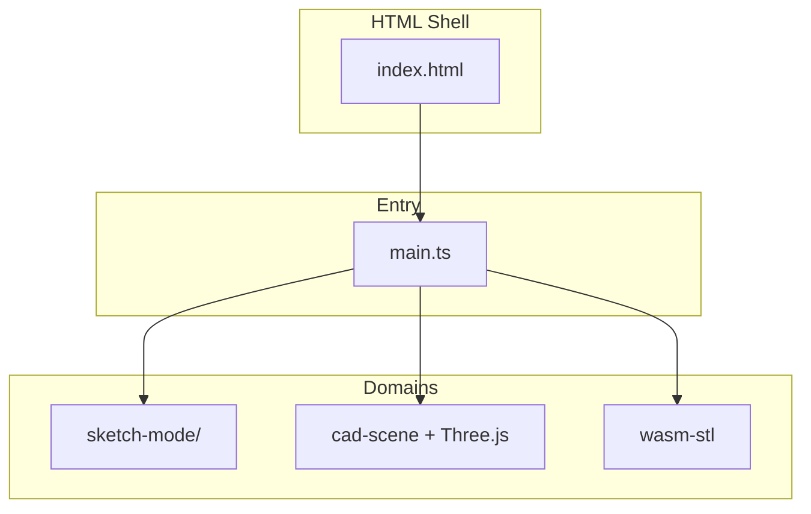

# CAD — Source Architecture

This document describes how the TypeScript codebase is organized and where to add new features.

## Design goals

- **No React** — plain DOM + Three.js; keep the render loop predictable.
- **Thin entry** — `main.ts` wires modules; domain logic lives in focused files.
- **Existing libs stay** — `cad-scene`, `drawing`, `sketch-dimension`, WASM, etc. are not duplicated.
- **German UI** — user-facing strings remain German unless requested otherwise.

## Directory layout

```
src/
├── main.ts                 # Boot, scene graph, pointer routing, most DOM bindings
├── types.ts                # Tool, Contour, PlaneAxis
├── app/                    # App shell: constants, DOM, utilities, shared types
│   ├── constants.ts        # Colors, TOOL_HINTS, alignment steps
│   ├── dom.ts              # Cached getElementById refs
│   ├── util.ts             # setStatus, uid, isTypingTarget
│   └── types.ts            # MeshEditDrag, SketchInteraction, DimSession
├── scene/                  # (future) init, render loop, camera presets
├── tools/
│   └── helpers.ts          # bodyGizmoTool, orbitToolActive, isSketchPrimitiveTool
├── sketch-mode/
│   └── dimensions.ts       # Fusion-style sketch dimension controller
├── input/
│   └── fusion-keyboard.ts  # Global shortcuts
├── sketch.ts               # Origin planes, grid helpers (pure geometry/UI)
├── sketch-geometry.ts      # Primitives, plane frame, snap
├── sketch-dimension.ts     # Dimension rendering + edge pick math
├── cad-scene.ts            # Component → Body hierarchy
├── project-file.ts         # .stpr JSON schema
└── …                       # body-edit, browser-panel, contour-spline, etc.
```

## Data flow



**State today:** Most mutable state (`contours`, `sketches`, `tool`, …) still lives in `main.ts`. New modules receive **host interfaces** (callbacks + getters) to avoid circular imports.

**Undo:** `undo.ts` snapshots via `captureSnapshot()`; `restoreSnapshot()` in `main.ts` is the integration hub.

## Adding a feature

| Feature type | Where to start |
|--------------|----------------|
| New sketch tool | `types.ts` Tool union → `index.html` ribbon → `sketch-mode/` or `main.ts` pointer branch |
| New dimension kind | `sketch-dimension.ts` → `sketch-mode/dimensions.ts` |
| New body tool | `body-edit.ts` + `main.ts` pointer branch |
| Project field | `project-file.ts` + bump `PROJECT_VERSION` if needed |
| Shortcut | `fusion-shortcuts.ts` + `input/fusion-keyboard.ts` |

## Planned extractions (from main.ts)

These domains are still in `main.ts` but are good next candidates:

1. `sketch-mode/lifecycle.ts` — `beginSketchOnPlane`, origin planes, grid
2. `sketch-mode/drawing.ts` — primitive drag/click handlers
3. `contours/draft.ts` — polyline, freehand, lasso
4. `scene/setup.ts` — renderer, lights, groups
5. `project/io.ts` — save/load STL and `.stpr`
6. `input/pointer-router.ts` — unified pointerdown/move/up

Extract **one domain at a time**, run `npm run build`, then commit.

## Module pattern: host + factory

Sketch dimensions use a factory to avoid a god-object singleton:

```typescript
const sketchDims = createSketchDimensionApi({
  getActiveSketchId: () => activeSketchId,
  getContours: () => contours,
  // …
});
sketchDims.handlePointerDown(e, controls, (id) => renderer.domElement.setPointerCapture(id));
```

New domains should follow the same pattern until a full `AppContext` is introduced.

## Build

```bash
npm run dev      # Vite :5173
npm run build    # WASM + production bundle
```

See also `AGENTS.md` for onboarding and git/repo notes.